# Vue

[toc]

## 一、项目初始化

### 1、创建项目

#### 1.1、使用Vue3创建项目

```
vue create supermall
```

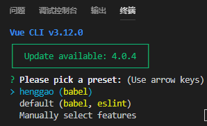

### 2、使用GItHub托管

#### 2.1、新建仓库

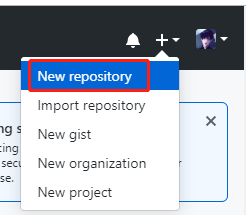

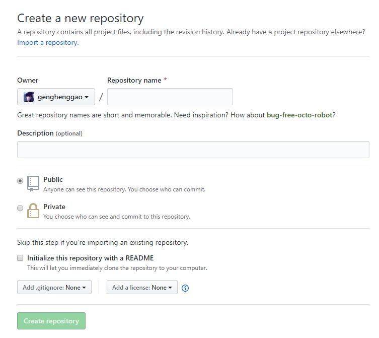

#### 2.2、关联远程仓库

```shell
git init
git remote add origin https://github.com/genghenggao/supermall.git
git push -u origin master
```

#### 2.3、查看

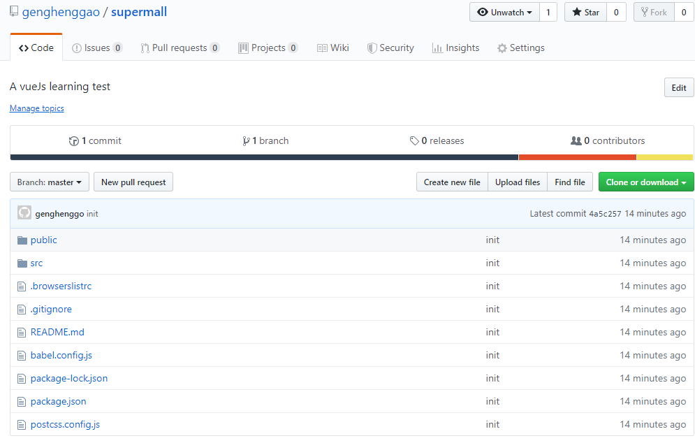

### 3、划分目录结构

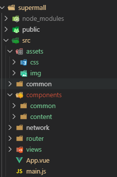

### 4、CSS文件的引入

#### 4.1、引入第三方CSS

normalize.css下载地址： https://github.com/necolas/normalize.css/tree/v2.1.3 

#### 4.2、创建自己的样式

创建自己的样式assets/css/base.css

```css
@import "./normalize.css";

/* :root ->获取根元素html */
:root {
  --color-text: #666;
  --color-high-text: #ff577f;
  --color-tint: #ff8198;
  --color-background: #fff;
  --font-size: 14px;
  --line-height: 1.5;
}

*,
*::before,
*::after {
  margin: 0;
  padding: 0;
  box-sizing: border-box;
}

body {
  font-family: "Helvetica Neue", Arial, Helvetica, sans-serif, "PingFang SC", "Hiragino Sans GB", "Miscrosoft YaHei", "微软雅黑";
  user-select: none;
  /*禁止用户鼠标在页面上选中文字/图片等*/
  -webkit-tap-highlight-color: transparent;
  /* webkit是苹果浏览器引擎，tap点击，highlight背景高亮，color颜色，颜色用数值调节*/
  background: var(--color-background);
  color: var(--color-text);
  /* rem vw/vh */
  width: 100vw;
}

a {
  color: var(--color-text);
  text-decoration: none;
}

.clear-fix::after {
  clear: both;
  content: '';
  display: block;
  width: 0;
  height: 0;
  visibility: hidden;
}

.clear-fix {
  zoom: 1;
}

.left {
  float: left;
}

```

在App.vue中引用

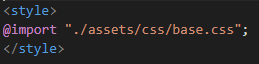

### 5、vue.config.js和editorconfig

##### 5.1、配置别名

新建src/vue.config.js（Vue3起别名方法改变，下面配置无效）

```js
module.exports = {
    configureWebpack: {
        resolve: {
            alias: {
                'assets': '@/assets',
                'common': '@/common',
                'components': '@/components',
                'network': '@/network',
                'views': '@/views'
            }
        },
    }
}
```

App.vue中引用可以简写为

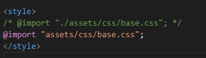

vue2中.editorconfig，vue3中没有，这是对代码的规范

```js
root = true

[*]
charset = utf-8
indent_style = space
indent_size = 2
end_of_line = lf
insert_final_newline = true
trim_trailing_whitespace = true
```

### 6、tabbar

#### 6.1、tabbar引入（一）

从06-tabbar中封装好的模块src/components/tabbar拷贝到supermall项目src/compomemts/common中

- common：放入与业务无关的模块

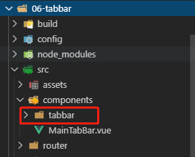

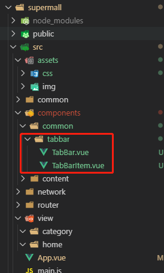

#### 6.2、tabbar引入（二）

从06-tabbar中封装好的模块src/components/MainTabBar.vue拷贝到supermall项目src/compomemts/mainTabbar/content中

- content：放入与业务有关的模块

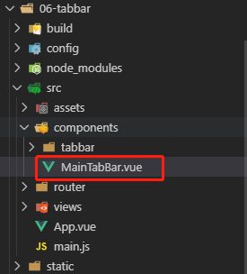


#### 6.3、图片资源

从06-tabbar中封装好的模块src/assets/img拷贝到supermall项目src/assets/img中

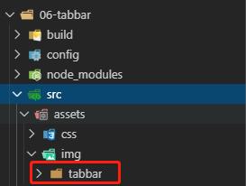

#### 6.4、修改路径

使用别名，修改对应文件引用路径

- MainTabBar.vue

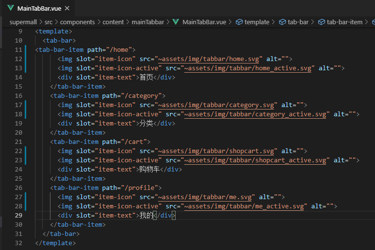


#### 6.5、安装router路由

```shell
npm install vue-router --save
```

从06-tabbar中封装好的模块src/router/index.js拷贝到supermall项目src/router中

- src/router/index.js

```js
/*
 * @Description: henggao_learning
 * @version: v1.0.0
 * @Author: henggao
 * @Date: 2019-10-22 20:17:01
 * @LastEditors: henggao
 * @LastEditTime: 2019-10-22 20:39:18
 */
import Vue from 'vue'
import VueRouter from 'vue-router'

// 导入，懒加载
const Home = () => import('@/views/home/Home.vue')
const Category = () => import('@/views/category/Category.vue')
const Profile = () => import('@/views/profile/Profile.vue')
const Cart = () => import('@/views/cart/Cart.vue')

// 1、安装插件
Vue.use(VueRouter)

// 2、创建路由对象
const routes = [
    {
        path: '',
        redirect: '/home'
    },
    {
        path: '/home',
        component: Home
    },
    {
        path: '/category',
        component: Category
    },
    {
        path: '/cart',
        component: Cart
    },
    {
        path: '/profile',
        component: Profile
    },
]

const router = new VueRouter({
    routes,
    // hash模式# ，使用history模式
    mode:'history'
})

// 3、导出router
export default router

```

mian.js挂载

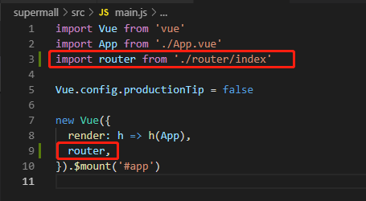

从06-tabbar中封装好的模块src/views中的文件拷贝到supermall项目src/views中

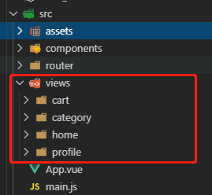

#### 6.6、App.vue

```vue
<!--
 * @Description: henggao_learning
 * @version: v1.0.0
 * @Author: henggao
 * @Date: 2019-10-22 18:17:06
 * @LastEditors: henggao
 * @LastEditTime: 2019-10-22 21:00:04
 -->
<template>
  <div id="app">
    <router-view></router-view>
    <main-tab-bar></main-tab-bar>
  </div>
</template>

<script>
// import MainTabBar from 'components/content/mainTabbar/MainTabBar'
import MainTabBar from './components/content/mainTabbar/MainTabBar'
export default {
  name: "app",
  components: {
    MainTabBar
  }
};
</script>

<style>
/* @import "./assets/css/base.css"; */
@import "assets/css/base.css";
</style>

```

#### 6.7、运行查看

```shell
npm run serve
```

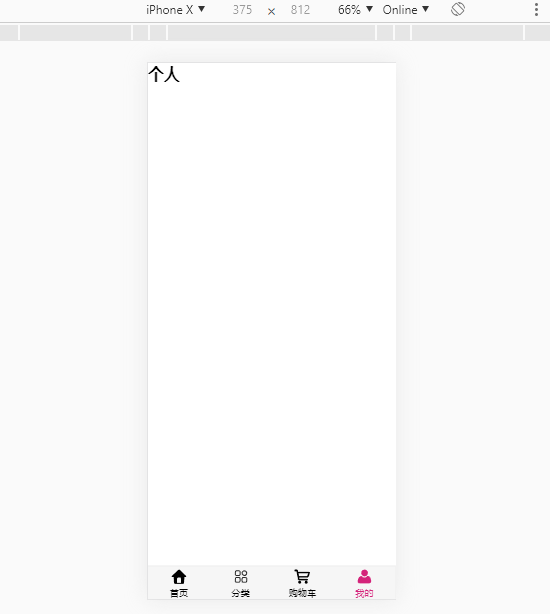

### 7、小图标的修改

7.1、图标存放位置

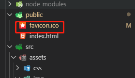

7.2、对应路径public/index.html

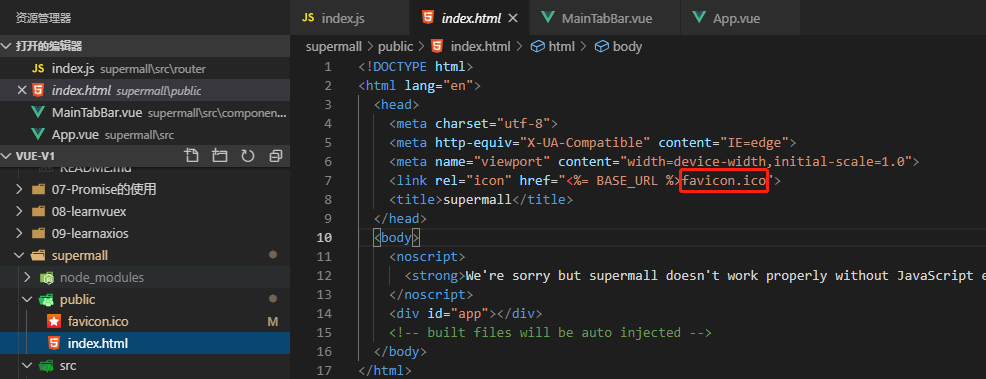


## 二、首页开发

### 1、首页导航栏

#### 1.1、首页导航栏封装和使用

##### 1.1.1、编写Home的导航栏

新建src/common/navbar/NavBarvue.vue

```vue
<!--
 * @Description: henggao_learning
 * @version: v1.0.0
 * @Author: henggao
 * @Date: 2019-10-23 08:11:16
 * @LastEditors: henggao
 * @LastEditTime: 2019-10-23 08:26:48
 -->
<template>
  <div class="nav-bar">
    <div class="left">
      <slot name="left"></slot>
    </div>
    <div class="center">
      <slot name="center"></slot>
    </div>
    <div class="right">
      <slot name="right"></slot>
    </div>
  </div>
</template>

<script>
export default {
  name: "NavBar"
};
</script>

<style>
.nav-bar {
  display: flex;
  height: 44px; 
  line-height: 44px;
}

.left,
.right {
  width: 60px;
  background-color: red;
}
.center {
  flex: 1;
  background-color: blue;
}
</style>
```

在src/view/home/Home.vue

```vue
<template>
  <div id="home">
    <nav-bar></nav-bar>
  </div>
</template>
<script>
import NavBar from "../../common/navbar/NavBar.vue";
export default {
  name: "Home",
  components: {
    NavBar
  }
};
</script>

<style>
</style>
```

查看

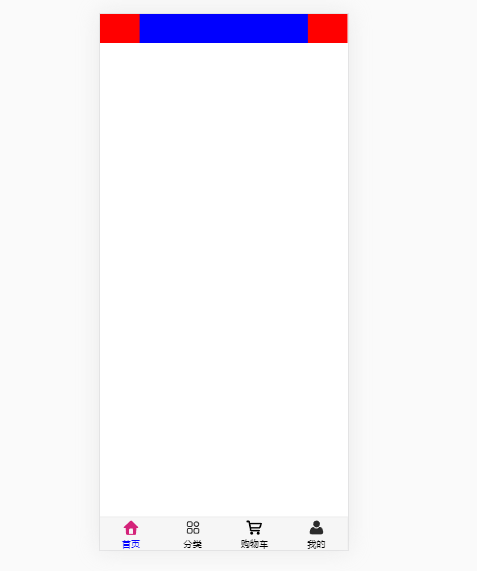

##### 1.1.2、编写Home的导航栏内容

src/views/home/Home.vue

```vue
<!--
 * @Description: henggao_learning
 * @version: v1.0.0
 * @Author: henggao
 * @Date: 2019-10-22 20:25:06
 * @LastEditors: henggao
 * @LastEditTime: 2019-10-23 09:04:15
 -->
<template>
  <div id="home">
    <nav-bar class="home-nav"><div slot="center">购物街</div></nav-bar>
  </div>
</template>
<script>
// import NavBar from "../../common/navbar/NavBar.vue";
import NavBar from "common/navbar/NavBar.vue";
export default {
  name: "Home",
  components: {
    NavBar
  }
};
</script>

<style>
.home-nav{
  background-color: var(--color-tint);
  color: #fff;
}
</style>
```

src/common/navbar/NavBar.vue

```vue
<!--
 * @Description: henggao_learning
 * @version: v1.0.0
 * @Author: henggao
 * @Date: 2019-10-23 08:11:16
 * @LastEditors: henggao
 * @LastEditTime: 2019-10-23 08:39:19
 -->
<template>
  <div class="nav-bar">
    <div class="left">
      <slot name="left"></slot>
    </div>
    <div class="center">
      <slot name="center"></slot>
    </div>
    <div class="right">
      <slot name="right"></slot>
    </div>
  </div>
</template>

<script>
export default {
  name: "NavBar"
};
</script>

<style>
.nav-bar {
  display: flex;
  height: 44px;
  /**有内容才可以，要需要设置一下height */
  line-height: 44px;
  text-align: center;
  box-shadow: 0 1px 1px rgba(100,100,100,0.1)
}

.left,
.right {
  width: 60px;
  /* background-color: red; */
}
.center {
  flex: 1;
  /* background-color: blue; */
}
</style>
```

查看


### 2、请求多个数据

#### 2.1、网络请求数据

network/request.js

```js
import axios from 'axios'

export function request(config) {
  const instance = axios.create({
    baseURL: 'http://123.207.32.32:8000/api/v1',
    timeout: 5000
  })

  instance.interceptors.request.use(config => {
    return config
  },err => {
    console.log(err);
  })

  instance.interceptors.response.use(res => {
    return res.data
  }, err => {
    console.log(err);
  })

  return instance(config)  //Promise
}
```

#### 2.2、安装axios

```shell
 npm install axios --save
```

#### 2.3、新建home.js

src/network/home.js

```js
import {request} from './request'

export function getHomeMultidata(){
    return request({
        url:'/home/multidata'
    })
}
```

#### 2.4、网络封装

home.vue

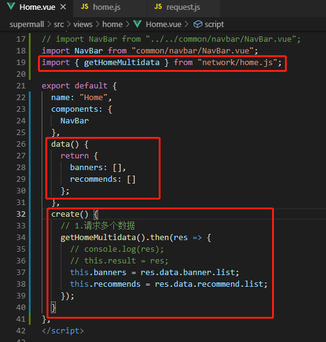

### 3、轮播图

#### 3.1、创建文件

- components/common/swiper

  - index.js
  - Swiper.vue
  - SwiperItem.vue

  

  - index.js

    ```js
    import Swiper from './Swiper'
    import SwiperItem from './SwiperItem'
    
    export {
      Swiper, SwiperItem
    }
    
    ```

    

  - Swiper.vue

    ```vue
    <template>
        <div id="hy-swiper">
          <div class="swiper" @touchstart="touchStart" @touchmove="touchMove" @touchend="touchEnd">
            <slot></slot>
          </div>
          <slot name="indicator">
          </slot>
          <div class="indicator">
            <slot name="indicator" v-if="showIndicator && slideCount>1">
              <div v-for="(item, index) in slideCount" class="indi-item" :class="{active: index === currentIndex-1}" :key="index"></div>
            </slot>
          </div>
        </div>
    </template>
    
    <script>
    	export default {
    		name: "Swiper",
        props: {
          interval: {
    		    type: Number,
            default: 3000
          },
          animDuration: {
    		    type: Number,
            default: 300
          },
          moveRatio: {
            type: Number,
            default: 0.25
          },
          showIndicator: {
            type: Boolean,
            default: true
          }
        },
        data: function () {
    		  return {
            slideCount: 0, // 元素个数
            totalWidth: 0, // swiper的宽度
            swiperStyle: {}, // swiper样式
            currentIndex: 1, // 当前的index
            scrolling: false, // 是否正在滚动
          }
        },
        mounted: function () {
          // 1.操作DOM, 在前后添加Slide
          setTimeout(() => {
            this.handleDom();
    
            // 2.开启定时器
            this.startTimer();
          }, 100)
        },
        methods: {
    		  /**
           * 定时器操作
           */
          startTimer: function () {
    		    this.playTimer = window.setInterval(() => {
    		      this.currentIndex++;
    		      this.scrollContent(-this.currentIndex * this.totalWidth);
            }, this.interval)
          },
          stopTimer: function () {
            window.clearInterval(this.playTimer);
          },
    
          /**
           * 滚动到正确的位置
           */
          scrollContent: function (currentPosition) {
            // 0.设置正在滚动
            this.scrolling = true;
    
            // 1.开始滚动动画
            this.swiperStyle.transition ='transform '+ this.animDuration + 'ms';
            this.setTransform(currentPosition);
    
            // 2.判断滚动到的位置
            this.checkPosition();
    
            // 4.滚动完成
            this.scrolling = false
          },
    
          /**
           * 校验正确的位置
           */
          checkPosition: function () {
            window.setTimeout(() => {
              // 1.校验正确的位置
              this.swiperStyle.transition = '0ms';
              if (this.currentIndex >= this.slideCount + 1) {
                this.currentIndex = 1;
                this.setTransform(-this.currentIndex * this.totalWidth);
              } else if (this.currentIndex <= 0) {
                this.currentIndex = this.slideCount;
                this.setTransform(-this.currentIndex * this.totalWidth);
              }
    
              // 2.结束移动后的回调
              this.$emit('transitionEnd', this.currentIndex-1);
            }, this.animDuration)
          },
    
          /**
           * 设置滚动的位置
           */
          setTransform: function (position) {
            this.swiperStyle.transform = `translate3d(${position}px, 0, 0)`;
            this.swiperStyle['-webkit-transform'] = `translate3d(${position}px), 0, 0`;
            this.swiperStyle['-ms-transform'] = `translate3d(${position}px), 0, 0`;
          },
    
          /**
           * 操作DOM, 在DOM前后添加Slide
           */
    		  handleDom: function () {
            // 1.获取要操作的元素
            let swiperEl = document.querySelector('.swiper');
            let slidesEls = swiperEl.getElementsByClassName('slide');
    
            // 2.保存个数
            this.slideCount = slidesEls.length;
    
            // 3.如果大于1个, 那么在前后分别添加一个slide
            if (this.slideCount > 1) {
              let cloneFirst = slidesEls[0].cloneNode(true);
              let cloneLast = slidesEls[this.slideCount - 1].cloneNode(true);
              swiperEl.insertBefore(cloneLast, slidesEls[0]);
              swiperEl.appendChild(cloneFirst);
              this.totalWidth = swiperEl.offsetWidth;
              this.swiperStyle = swiperEl.style;
            }
    
            // 4.让swiper元素, 显示第一个(目前是显示前面添加的最后一个元素)
            this.setTransform(-this.totalWidth);
          },
    
          /**
           * 拖动事件的处理
           */
          touchStart: function (e) {
            // 1.如果正在滚动, 不可以拖动
            if (this.scrolling) return;
    
            // 2.停止定时器
            this.stopTimer();
    
            // 3.保存开始滚动的位置
            this.startX = e.touches[0].pageX;
          },
    
          touchMove: function (e) {
            // 1.计算出用户拖动的距离
            this.currentX = e.touches[0].pageX;
            this.distance = this.currentX - this.startX;
            let currentPosition = -this.currentIndex * this.totalWidth;
            let moveDistance = this.distance + currentPosition;
    
            // 2.设置当前的位置
            this.setTransform(moveDistance);
          },
    
          touchEnd: function (e) {
            // 1.获取移动的距离
            let currentMove = Math.abs(this.distance);
    
            // 2.判断最终的距离
            if (this.distance === 0) {
              return
            } else if (this.distance > 0 && currentMove > this.totalWidth * this.moveRatio) { // 右边移动超过0.5
              this.currentIndex--
            } else if (this.distance < 0 && currentMove > this.totalWidth * this.moveRatio) { // 向左移动超过0.5
              this.currentIndex++
            }
    
            // 3.移动到正确的位置
            this.scrollContent(-this.currentIndex * this.totalWidth);
    
            // 4.移动完成后重新开启定时器
            this.startTimer();
          },
    
          /**
           * 控制上一个, 下一个
           */
          previous: function () {
            this.changeItem(-1);
          },
    
          next: function () {
            this.changeItem(1);
          },
    
          changeItem: function (num) {
            // 1.移除定时器
            this.stopTimer();
    
            // 2.修改index和位置
            this.currentIndex += num;
            this.scrollContent(-this.currentIndex * this.totalWidth);
    
            // 3.添加定时器
            this.startTimer();
          }
        }
    	}
    </script>
    
    <style scoped>
      #hy-swiper {
        overflow: hidden;
        position: relative;
      }
    
      .swiper {
        display: flex;
      }
    
      .indicator {
        display: flex;
        justify-content: center;
        position: absolute;
        width: 100%;
        bottom: 8px;
      }
    
      .indi-item {
        box-sizing: border-box;
        width: 8px;
        height: 8px;
        border-radius: 4px;
        background-color: #fff;
        line-height: 8px;
        text-align: center;
        font-size: 12px;
        margin: 0 5px;
      }
    
      .indi-item.active {
        background-color: rgba(212,62,46,1.0);
      }
    </style>
    
    ```

    

  - SwiperItem.vue

    ```vue
    <template>
      <div class="slide">
        <slot></slot>
      </div>
    </template>
    
    <script>
    	export default {
    		name: "Slide"
    	}
    </script>
    
    <style scoped>
      .slide {
        width: 100%;
        flex-shrink: 0;
      }
    
      .slide img {
        width: 100%;
      }
    </style>
    
    ```

    

#### 3.2、导入

Home.vue加载

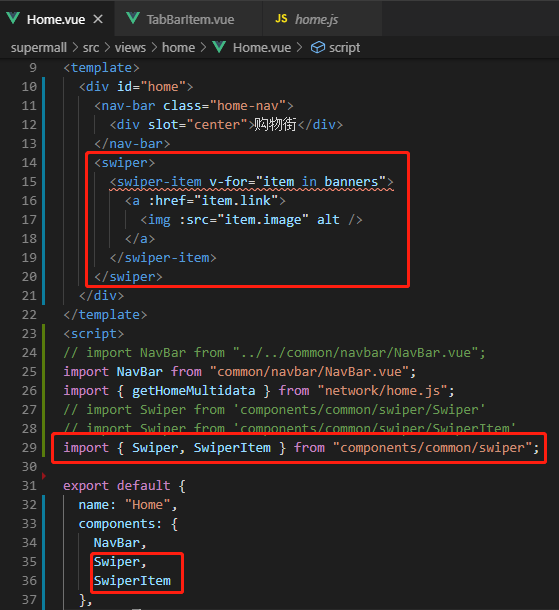

- 对轮播图模块进行封装

提取内容到views/home/childComps/HomeSwiper.vue

```vue
<template>
  <swiper>
    <swiper-item v-for="item in banners">
      <a :href="item.link">
        
      </a>
    </swiper-item>
  </swiper>
</template>

<script>
import { Swiper, SwiperItem } from "components/common/swiper";
export default {
  name: "HomeSwiper",
  props: {
    banners: {
      type: Array,
      default() {
        return [];
      }
    }
  },
  components: {
    Swiper,
    SwiperItem
  }
};
</script>

<style>
</style>
```

- Home.vue

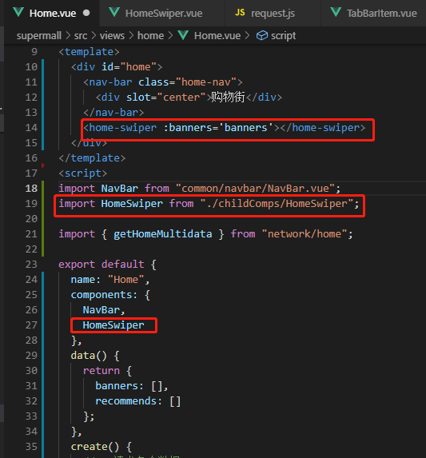

### 4、推荐信息的展示

- views/home/childComps/RecommendView.vue

```vue
<!--
 * @Description: henggao_learning
 * @version: v1.0.0
 * @Author: henggao
 * @Date: 2019-10-23 14:50:59
 * @LastEditors: henggao
 * @LastEditTime: 2019-10-23 15:08:25
 -->
<template>
  <div class="recommend">
    <div v-for="item in recommends" class="recommend-item">
      <a :href="item.link">
        
        <div>{{item.title}}</div>
      </a>
    </div>
  </div>
</template>

<script>
export default {
  name: "RecommendView",
  props: {
    recommends: {
      type: Array,
      default() {
        return [];
      }
    }
  }
};
</script>

<style>
.recommend {
  display: flex;
  width: 100%;
  text-align: center;
  font-size: 12px;
  padding: 10px 0 20px;
  border-bottom: 8px solid #eee;
}

.recommend-item {
  flex: 1;
}

.recommend-item img {
  width: 70px;
  height: 70px;
  margin-bottom: 10px;
}
</style>
```

- Home.vue

  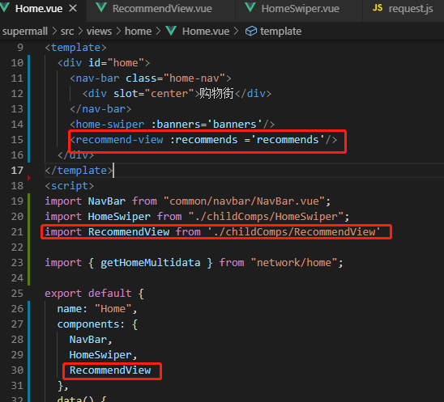

### 5、FeatureView的封装

- views/home/childComps/FeatireView.vue

```vue
<template>
  <div class="feature">
    <a href="https://act.mogujie.com/zzlx67">
      
    </a>
  </div>
</template>

<script>
  export default {
    name: "FeatureView"
  }
</script>

<style scoped>
  .feature img {
    width: 100%;
  }
</style>
```

- Home.vue

  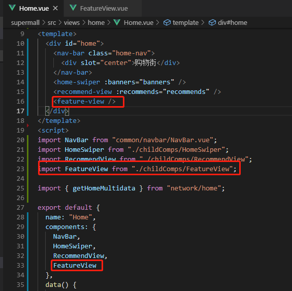

- Home.vue设置样式

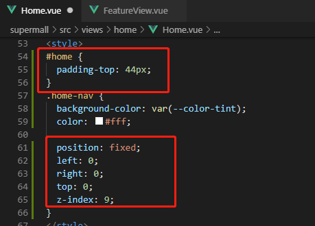

### 6、TabControl的封装

- sr/components/content/tabControl/TabControl.vue

```vue
<!--
 * @Description: henggao_learning
 * @version: v1.0.0
 * @Author: henggao
 * @Date: 2019-10-23 15:48:33
 * @LastEditors: henggao
 * @LastEditTime: 2019-10-23 16:35:32
 -->
<template>
  <div class="tab-control">
    <div
      v-for="(item,index) in titles"
      class="tab-control-item"
      :class="{active: index === currentIndex}"
      :key="item"
      @click="itemClick(index)"
    >
      <span>{{item}}</span>
    </div>
  </div>
</template>

<script>
export default {
  name: "TabControl",
  props: {
    titles: {
      type: Array,
      default() {
        return [];
      }
    }
  },
  data() {
    return {
      currentIndex: 0
    };
  },
  methods: {
    itemClick(index) {
      this.currentIndex = index;
    }
  }
};
</script>

<style>
.tab-control {
  display: flex;
  text-align: center;
  font-size: 15px;
  height: 40px;
  line-height: 40px;
  background-color: #fff;
}

.tab-control-item {
  flex: 1;
}

.active {
  color: var(--color-high-text);
}

.active span {
  border-bottom: 3px solid var(--color-tint);
}
</style>
```

- Home.vue

  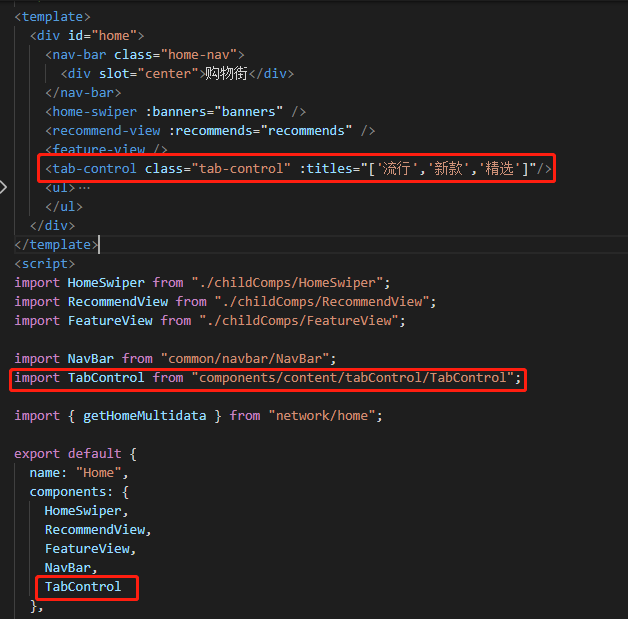

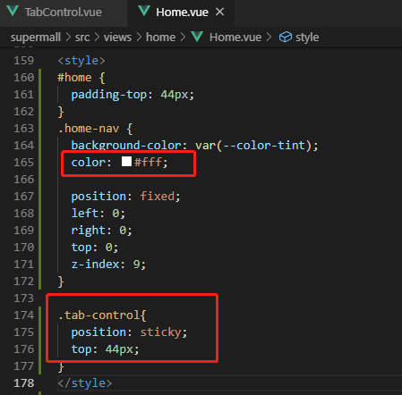

查看

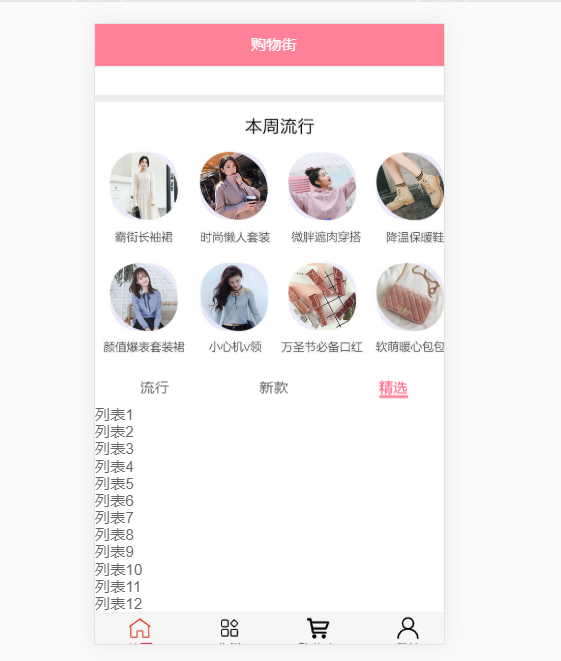

### 7、商品数据结构设计

```js
goods:{
    'pop':{page:0,list:[]},
    'news':{page:0,list:[]},
    'sell':{page:0,list:[]}
}
```


- Home.vue

  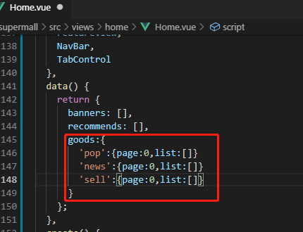

### 8、首页数据的请求和保存

- src/network/home.js

  ```js
  export function getHomeMultidata() {
      return request({
        url: '/home/multidata'
      })
    }
    
    export function getHomeGoods(type, page) {
      return request({
        url: '/home/data',
        params: {
          type,
          page
        }
      })
    }
  ```

- Home.vue

  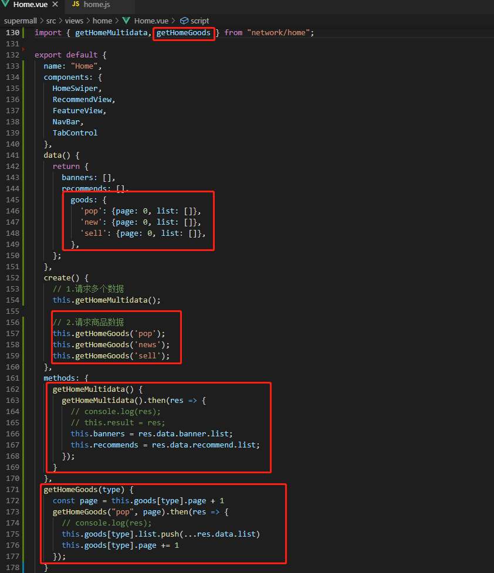

  

### 9、首页商品数据的展示

- components/content/goods/GoodsList.vue

```vue
<!--
 * @Description: henggao_learning
 * @version: v1.0.0
 * @Author: henggao
 * @Date: 2019-10-23 19:29:20
 * @LastEditors: henggao
 * @LastEditTime: 2019-10-23 20:00:05
 -->
<template>
  <div class="goods">
    <goods-list-item v-for="item in goods" :goods-item="item" :key="item"/>
  </div>
</template>

<script>
  import GoodsListItem from "./GoodsListItem";

  export default {
    name: "GoodsList",
    components: {
      GoodsListItem
    },
    props: {
      goods: {
        type: Array,
        default() {
          return []
        }
      }
    }
  }
</script>

<style scoped>
  .goods {
    display: flex;
    flex-wrap: wrap;
    justify-content: space-around;
    padding: 2px;
  }
</style>
```

- components/content/goods/GoodsListItem.vue

```vue
<!--
 * @Description: henggao_learning
 * @version: v1.0.0
 * @Author: henggao
 * @Date: 2019-10-23 19:30:13
 * @LastEditors: henggao
 * @LastEditTime: 2019-10-23 19:58:30
 -->
<template>
  <div class="goods-item" @click="itemClick">
    
    <div class="goods-info">
      <p>{{goodsItem.title}}</p>
      <span class="price">{{goodsItem.price}}</span>
      <span class="collect">{{goodsItem.cfav}}</span>
    </div>
  </div>
</template>

<script>
  export default {
    name: "GoodsListItem",
    props: {
      goodsItem: {
        type: Object,
        default() {
          return {}
        }
      }
    },
    computed: {
      showImage() {
        return this.goodsItem.image || this.goodsItem.show.img
      }
    },
    methods: {
      imageLoad() {
        this.$bus.$emit('itemImageLoad')
      },
      itemClick() {
        this.$router.push('/detail/' + this.goodsItem.iid)
      }
    }
  }
</script>

<style scoped>
  .goods-item {
    padding-bottom: 40px;
    position: relative;
    width: 48%;
  }

  .goods-item img {
    width: 100%;
    border-radius: 5px;
  }

  .goods-info {
    font-size: 12px;
    position: absolute;
    bottom: 5px;
    left: 0;
    right: 0;
    overflow: hidden;
    text-align: center;
  }

  .goods-info p {
    overflow: hidden;
    text-overflow: ellipsis;
    white-space: nowrap;
    margin-bottom: 3px;
    padding-top: 5px;
  }

  .goods-info .price {
    color: var(--color-high-text);
    margin-right: 20px;
  }

  .goods-info .collect {
    position: relative;
  }

  .goods-info .collect::before {
    content: '';
    position: absolute;
    left: -15px;
    top: -1px;
    width: 14px;
    height: 14px;
    background: url("~assets/img/common/collect.svg") 0 0/14px 14px;
  }
</style>
```

- Home.vue

  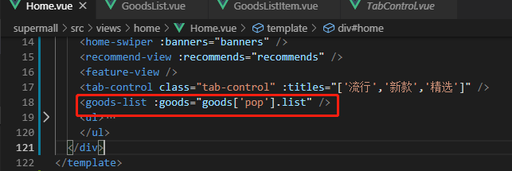

### 10、TabControl点击切换商品

- src/components/content/tabControl/TabControl.vue

  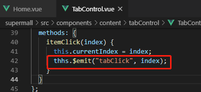

- Home.vue

  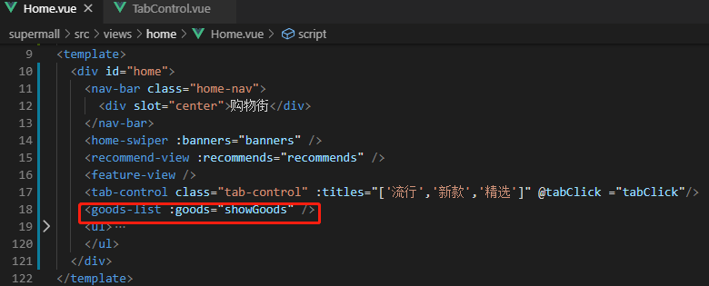

  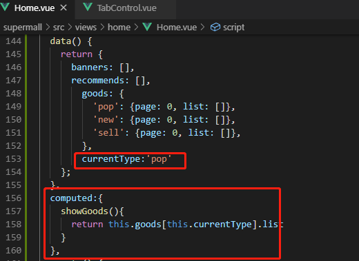

  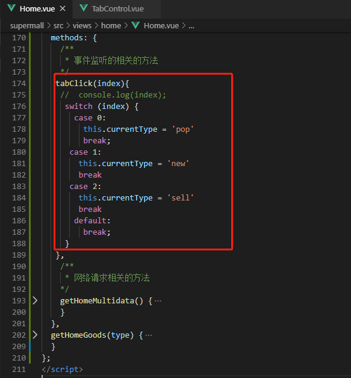

### 11、Better-Scroll的安装和使用

Better-scroll 完成移动端滚动： https://ustbhuangyi.github.io/better-scroll/doc/zh-hans/ 

#### 11.1、安装

```shell
npm install better-scroll --save
```

#### 11.2、引用Better-Scroll

- src/views/category/Category.vue

```vue
<!--
 * @Description: henggao_learning
 * @version: v1.0.0
 * @Author: henggao
 * @Date: 2019-10-22 20:25:06
 * @LastEditors: henggao
 * @LastEditTime: 2019-10-23 22:23:13
 -->
<template>
  <div class="wrapper">
    <ul class="content">
      <li>分类列表1</li>
      <li>分类列表2</li>
      <li>分类列表3</li>
      <li>分类列表4</li>
      <li>分类列表5</li>
      <li>分类列表6</li>
      <li>分类列表7</li>
      <li>分类列表8</li>
      <li>分类列表9</li>
      <li>分类列表10</li>
      <li>分类列表11</li>
      <li>分类列表12</li>
      <li>分类列表13</li>
      <li>分类列表14</li>
      <li>分类列表15</li>
      <li>分类列表16</li>
      <li>分类列表17</li>
      <li>分类列表18</li>
      <li>分类列表19</li>
      <li>分类列表20</li>
      <li>分类列表21</li>
      <li>分类列表22</li>
      <li>分类列表23</li>
      <li>分类列表24</li>
      <li>分类列表25</li>
      <li>分类列表26</li>
      <li>分类列表27</li>
      <li>分类列表28</li>
      <li>分类列表29</li>
      <li>分类列表30</li>
      <li>分类列表31</li>
      <li>分类列表32</li>
      <li>分类列表33</li>
      <li>分类列表34</li>
      <li>分类列表35</li>
      <li>分类列表36</li>
      <li>分类列表37</li>
      <li>分类列表38</li>
      <li>分类列表39</li>
      <li>分类列表40</li>
      <li>分类列表41</li>
      <li>分类列表42</li>
      <li>分类列表43</li>
      <li>分类列表44</li>
      <li>分类列表45</li>
      <li>分类列表46</li>
      <li>分类列表47</li>
      <li>分类列表48</li>
      <li>分类列表49</li>
      <li>分类列表50</li>
      <li>分类列表51</li>
      <li>分类列表52</li>
      <li>分类列表53</li>
      <li>分类列表54</li>
      <li>分类列表55</li>
      <li>分类列表56</li>
      <li>分类列表57</li>
      <li>分类列表58</li>
      <li>分类列表59</li>
      <li>分类列表60</li>
      <li>分类列表61</li>
      <li>分类列表62</li>
      <li>分类列表63</li>
      <li>分类列表64</li>
      <li>分类列表65</li>
      <li>分类列表66</li>
      <li>分类列表67</li>
      <li>分类列表68</li>
      <li>分类列表69</li>
      <li>分类列表70</li>
      <li>分类列表71</li>
      <li>分类列表72</li>
      <li>分类列表73</li>
      <li>分类列表74</li>
      <li>分类列表75</li>
      <li>分类列表76</li>
      <li>分类列表77</li>
      <li>分类列表78</li>
      <li>分类列表79</li>
      <li>分类列表80</li>
      <li>分类列表81</li>
      <li>分类列表82</li>
      <li>分类列表83</li>
      <li>分类列表84</li>
      <li>分类列表85</li>
      <li>分类列表86</li>
      <li>分类列表87</li>
      <li>分类列表88</li>
      <li>分类列表89</li>
      <li>分类列表90</li>
      <li>分类列表91</li>
      <li>分类列表92</li>
      <li>分类列表93</li>
      <li>分类列表94</li>
      <li>分类列表95</li>
      <li>分类列表96</li>
      <li>分类列表97</li>
      <li>分类列表98</li>
      <li>分类列表99</li>
      <li>分类列表100</li>
    </ul>
  </div>
</template>

<script>
import BScroll from "better-scroll";

export default {
  name: "Category",
  created() {
    // this.scroll = new BScroll('.wrapper',{
    // })
  },
  mounted() {
    this.scroll = new BScroll(document.querySelector(".wrapper"), {});
  }
};
</script>

<style>
.wrapper {
  height: 150px;
  background-color: #f90899;

  overflow: hidden;
  /* overflow-y: scroll; */
}
</style>
```

查看

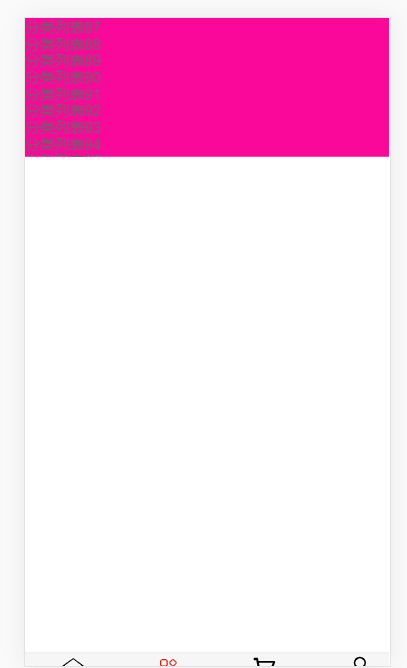

#### 11.3、Better-Scroll基本使用

- 新建文件10-learnBS/01-BScroll的基本使用.html

```html
<!--
 * @Description: henggao_learning
 * @version: v1.0.0
 * @Author: henggao
 * @Date: 2019-10-24 08:19:25
 * @LastEditors: henggao
 * @LastEditTime: 2019-10-24 08:55:28
 -->
<!DOCTYPE html>
<html lang="en">

<head>
    <meta charset="UTF-8">
    <meta name="viewport" content="width=device-width, initial-scale=1.0">
    <meta http-equiv="X-UA-Compatible" content="ie=edge">
    <title>Document</title>
    <style>
        .content {
            height: 200px;
            background-color: red;
            overflow: hidden;
        }
    </style>
</head>

<body>
    <div class="content">
        <ul>
            <button class="btn">按钮</button>
            <li>列表数据1</li>
            <li>列表数据2</li>
            <li>列表数据3</li>
            <li>列表数据4</li>
            <li>列表数据5</li>
            <li>列表数据6</li>
            <li>列表数据7</li>
            <li>列表数据8</li>
            <li>列表数据9</li>
            <li>列表数据10</li>
            <li>列表数据11</li>
            <li>列表数据12</li>
            <li>列表数据13</li>
            <li>列表数据14</li>
            <li>列表数据15</li>
            <li>列表数据16</li>
            <li>列表数据17</li>
            <li>列表数据18</li>
            <li>列表数据19</li>
            <li>列表数据20</li>
            <li>列表数据21</li>
            <li>列表数据22</li>
            <li>列表数据23</li>
            <li>列表数据24</li>
            <li>列表数据25</li>
            <li>列表数据26</li>
            <li>列表数据27</li>
            <li>列表数据28</li>
            <li>列表数据29</li>
            <li>列表数据30</li>
            <li>列表数据31</li>
            <li>列表数据32</li>
            <li>列表数据33</li>
            <li>列表数据34</li>
            <li>列表数据35</li>
            <li>列表数据36</li>
            <li>列表数据37</li>
            <li>列表数据38</li>
            <li>列表数据39</li>
            <li>列表数据40</li>
            <li>列表数据41</li>
            <li>列表数据42</li>
            <li>列表数据43</li>
            <li>列表数据44</li>
            <li>列表数据45</li>
            <li>列表数据46</li>
            <li>列表数据47</li>
            <li>列表数据48</li>
            <li>列表数据49</li>
            <li>列表数据50</li>
            <li>列表数据51</li>
            <li>列表数据52</li>
            <li>列表数据53</li>
            <li>列表数据54</li>
            <li>列表数据55</li>
            <li>列表数据56</li>
            <li>列表数据57</li>
            <li>列表数据58</li>
            <li>列表数据59</li>
            <li>列表数据60</li>
            <li>列表数据61</li>
            <li>列表数据62</li>
            <li>列表数据63</li>
            <li>列表数据64</li>
            <li>列表数据65</li>
            <li>列表数据66</li>
            <li>列表数据67</li>
            <li>列表数据68</li>
            <li>列表数据69</li>
            <li>列表数据70</li>
            <li>列表数据71</li>
            <li>列表数据72</li>
            <li>列表数据73</li>
            <li>列表数据74</li>
            <li>列表数据75</li>
            <li>列表数据76</li>
            <li>列表数据77</li>
            <li>列表数据78</li>
            <li>列表数据79</li>
            <li>列表数据80</li>
            <li>列表数据81</li>
            <li>列表数据82</li>
            <li>列表数据83</li>
            <li>列表数据84</li>
            <li>列表数据85</li>
            <li>列表数据86</li>
            <li>列表数据87</li>
            <li>列表数据88</li>
            <li>列表数据89</li>
            <li>列表数据90</li>
            <li>列表数据91</li>
            <li>列表数据92</li>
            <li>列表数据93</li>
            <li>列表数据94</li>
            <li>列表数据95</li>
            <li>列表数据96</li>
            <li>列表数据97</li>
            <li>列表数据98</li>
            <li>列表数据99</li>
            <li>列表数据100</li>
        </ul>
    </div>
    <script src="./bscroll.js"></script>
    <script>
        // 默认情况下BScroll是不可以实时的监听滚动位置
        // probe 侦测
        // 0，1都是不侦测实时位置
        // 2： 在手指滚动的过程中侦测，手指离开后的惯性滚动过程不侦测
        // 3： 只要是滚动，都侦测
        const bscroll = new BScroll(document.querySelector('.content'), {
            probeType: 3,
            click: true,
            pullUpLoad: true
        })

        bscroll.on('scroll', (position) => {
            // console.log(position);
        })

        bscroll.on('pullingUp', () => {
            console.log('上拉加载更多');
            // 发送网络请求，请求更多页的数据

            // 数据请求完成，并且新的数据展示出来后
            setTimeout(() => {
                bscroll.finishPullUp()

            }, 2000)
        })

        document.querySelector('.btn').addEventListener('click', function () {
            console.log('-----');
        })
    </script>
</body>

</html>
```

#### 11.4、Better-Scroll在Vue项目中的使用

- 对Better-Scroll进行封装，创建src/components/common/scroll/Scroll.vue

```vue
<!--
 * @Description: henggao_learning
 * @version: v1.0.0
 * @Author: henggao
 * @Date: 2019-10-24 09:21:57
 * @LastEditors: henggao
 * @LastEditTime: 2019-10-24 10:06:54
 -->
<template>
  <div class="wrapper" ref="wrapper">
    <div class="content">
      <slot></slot>
    </div>
  </div>
</template>

<script>
import BScroll from "better-scroll";
export default {
  name: "Scroll",
  data() {
    return {
      scroll: null
    };
  },
  mounted() {
    this.scroll = new BScroll(this.$refs.wrapper, {});
  }
};
</script>

<style>
</style>
```

- Home.vue

  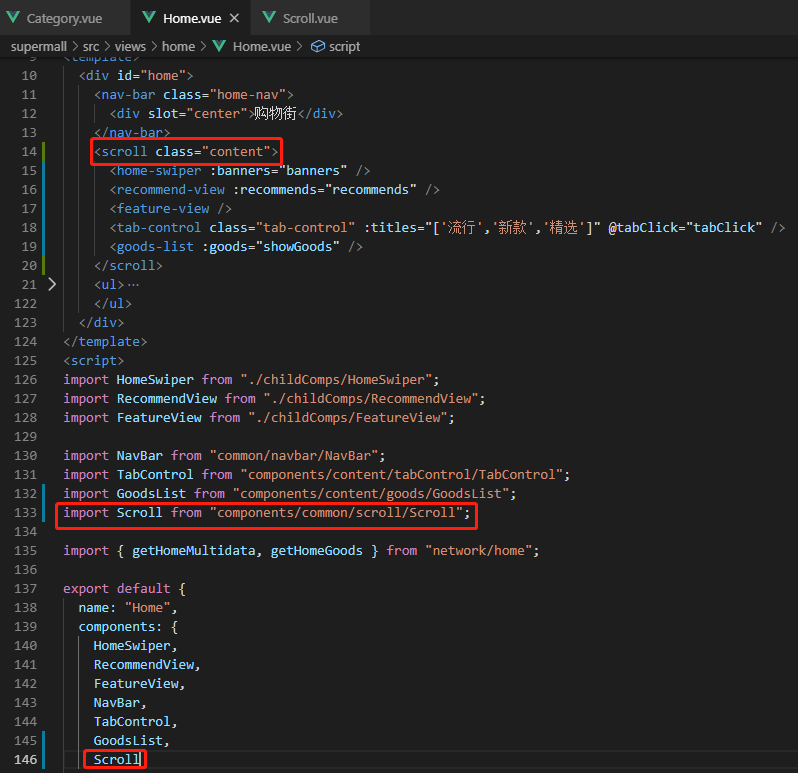

设置Home.vue样式

```js
<style scoped>
#home {
  padding-top: 44px;
  height: 100vh;
  position: relative;
}
.home-nav {
  background-color: var(--color-tint);
  color: #fff;

  position: fixed;
  left: 0;
  right: 0;
  top: 0;
  z-index: 9;
}

.tab-control {
  position: sticky;
  top: 44px;
  z-index: 9;
}

.content {
  height: 300px;
  overflow: hidden;
  position: absolute;
  top:44px;
  bottom: 49px;
  left: 0;
  right: 0;
}
</style>
```

### 12、BackTop组件的封装和使用

#### 12.1、BackTop组件的封装和使用

- 新建src/components/content/backTop/BackTo.vue

  ```vue
  <template>
    <div class="back-top">
      
    </div>
  </template>
  
  <script>
  export default {
      name:'BackTop',
  };
  </script>
  
  <style>
  .back-top {
    position: fixed;
    right: 8px;
    bottom: 55px;
  }
  
  .back-top img {
    width: 43px;
    height: 43px;
  }
  </style>
  ```

  

- Scroll.vue

  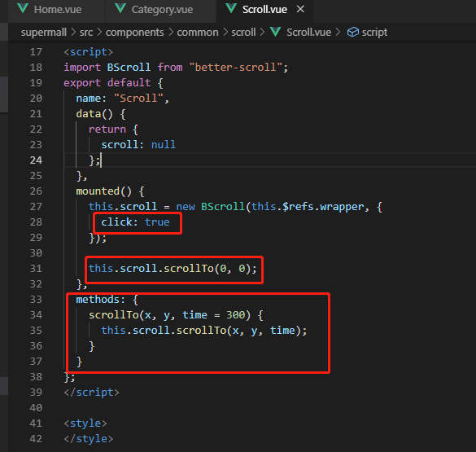

- Home.vue

  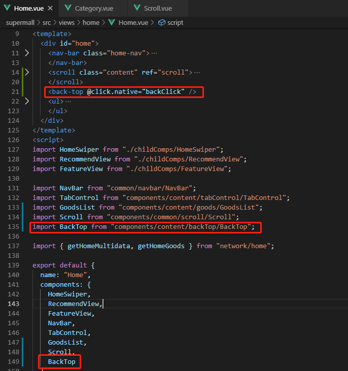

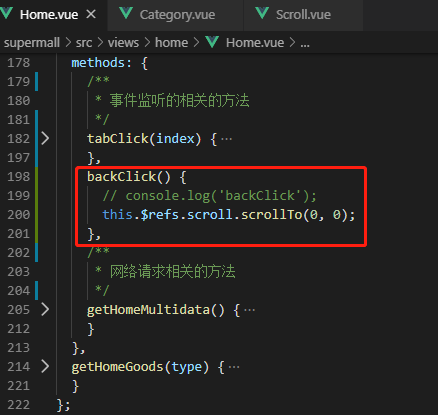

#### 12.2、BackTop组件的显示和隐藏

- Scroll.vue

  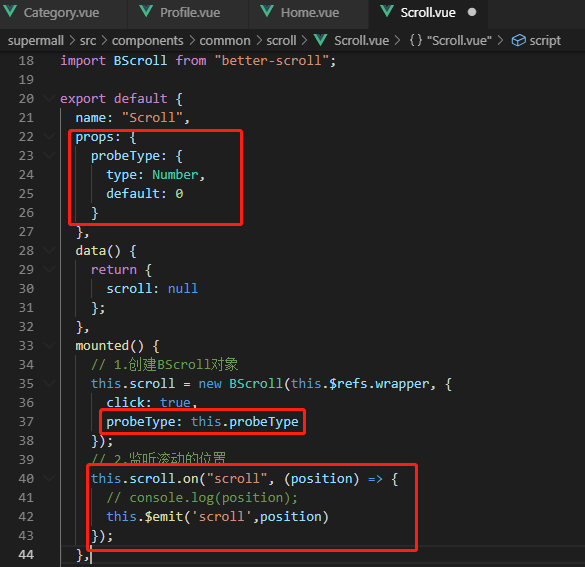

- Home.vue

  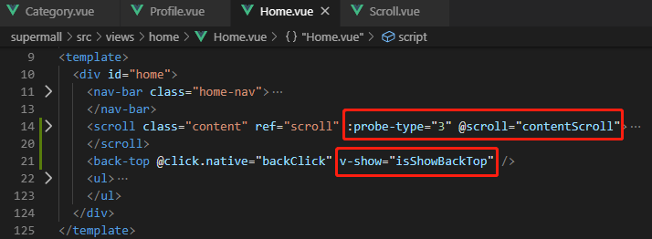

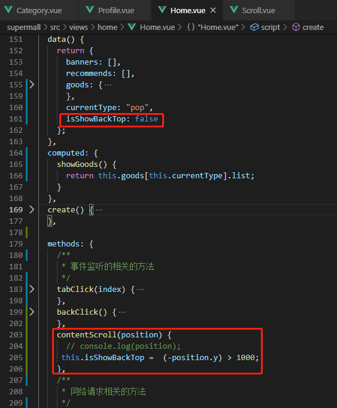

- profile.vue

  ```vue
  <!--
   * @Description: henggao_learning
   * @version: v1.0.0
   * @Author: henggao
   * @Date: 2019-10-18 18:40:57
   * @LastEditors: henggao
   * @LastEditTime: 2019-10-24 14:58:57
   -->
  <template>
    <div>
      <scroll class="content">
        <ul>
          <li>个人信息1</li>
          <li>个人信息2</li>
          <li>个人信息3</li>
          <li>个人信息4</li>
          <li>个人信息5</li>
          <li>个人信息6</li>
          <li>个人信息7</li>
          <li>个人信息8</li>
          <li>个人信息9</li>
          <li>个人信息10</li>
          <li>个人信息11</li>
          <li>个人信息12</li>
          <li>个人信息13</li>
          <li>个人信息14</li>
          <li>个人信息15</li>
          <li>个人信息16</li>
          <li>个人信息17</li>
          <li>个人信息18</li>
          <li>个人信息19</li>
          <li>个人信息20</li>
          <li>个人信息21</li>
          <li>个人信息22</li>
          <li>个人信息23</li>
          <li>个人信息24</li>
          <li>个人信息25</li>
          <li>个人信息26</li>
          <li>个人信息27</li>
          <li>个人信息28</li>
          <li>个人信息29</li>
          <li>个人信息30</li>
          <li>个人信息31</li>
          <li>个人信息32</li>
          <li>个人信息33</li>
          <li>个人信息34</li>
          <li>个人信息35</li>
          <li>个人信息36</li>
          <li>个人信息37</li>
          <li>个人信息38</li>
          <li>个人信息39</li>
          <li>个人信息40</li>
          <li>个人信息41</li>
          <li>个人信息42</li>
          <li>个人信息43</li>
          <li>个人信息44</li>
          <li>个人信息45</li>
          <li>个人信息46</li>
          <li>个人信息47</li>
          <li>个人信息48</li>
          <li>个人信息49</li>
          <li>个人信息50</li>
          <li>个人信息51</li>
          <li>个人信息52</li>
          <li>个人信息53</li>
          <li>个人信息54</li>
          <li>个人信息55</li>
          <li>个人信息56</li>
          <li>个人信息57</li>
          <li>个人信息58</li>
          <li>个人信息59</li>
          <li>个人信息60</li>
          <li>个人信息61</li>
          <li>个人信息62</li>
          <li>个人信息63</li>
          <li>个人信息64</li>
          <li>个人信息65</li>
          <li>个人信息66</li>
          <li>个人信息67</li>
          <li>个人信息68</li>
          <li>个人信息69</li>
          <li>个人信息70</li>
          <li>个人信息71</li>
          <li>个人信息72</li>
          <li>个人信息73</li>
          <li>个人信息74</li>
          <li>个人信息75</li>
          <li>个人信息76</li>
          <li>个人信息77</li>
          <li>个人信息78</li>
          <li>个人信息79</li>
          <li>个人信息80</li>
          <li>个人信息81</li>
          <li>个人信息82</li>
          <li>个人信息83</li>
          <li>个人信息84</li>
          <li>个人信息85</li>
          <li>个人信息86</li>
          <li>个人信息87</li>
          <li>个人信息88</li>
          <li>个人信息89</li>
          <li>个人信息90</li>
          <li>个人信息91</li>
          <li>个人信息92</li>
          <li>个人信息93</li>
          <li>个人信息94</li>
          <li>个人信息95</li>
          <li>个人信息96</li>
          <li>个人信息97</li>
          <li>个人信息98</li>
          <li>个人信息99</li>
          <li>个人信息100</li>
        </ul>
      </scroll>
    </div>
  </template>
  
  <script>
  import Scroll from "components/common/scroll/Scroll";
  
  export default {
    name: "Profile",
    components: {
      Scroll
    }
  };
  </script>
  
  <style>
  .content {
    height: 300px;
    background-color: red;
    overflow: hidden;
  }
  </style>
  ```

  

### 13、上拉加载更多

P1-P169 p226-p231 看完

P170-P225 未看

