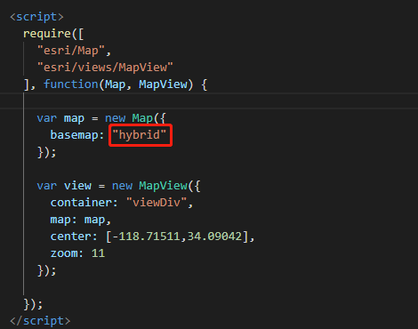
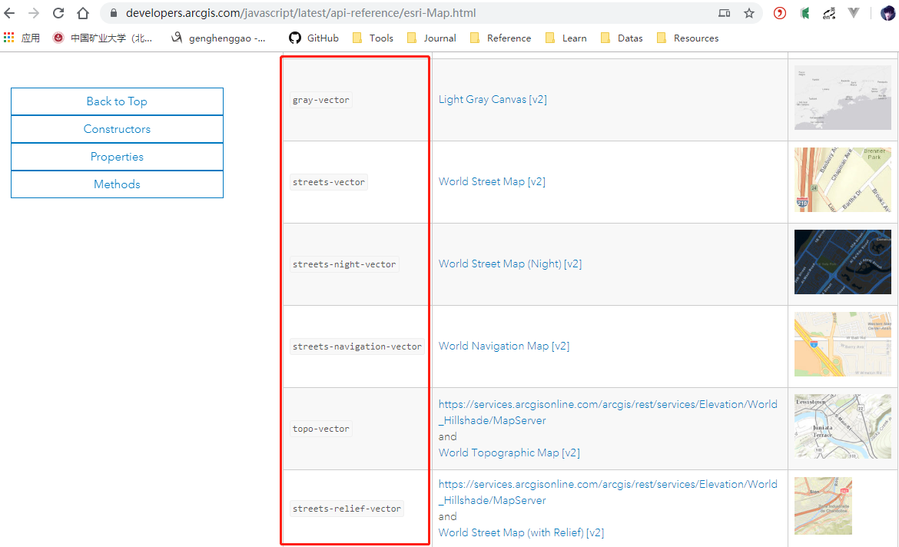

# BaseMap

[TOC]

## 一、BaseMap底图设置

```html
<!--
 * @Description: henggao_learning
 * @version: v1.0.0
 * @Author: henggao
 * @Date: 2019-11-07 20:16:04
 * @LastEditors: henggao
 * @LastEditTime: 2019-11-08 15:02:43
 -->
<html>
<head>
  <meta charset="utf-8">
  <meta name="viewport" content="initial-scale=1, maximum-scale=1, user-scalable=no">
  <title>ArcGIS API for JavaScript Hello World App</title>
  <style>
    html, body, #viewDiv {
      padding: 0;
      margin: 0;                                                                                                                                                                        
      height: 100%;
      width: 100%;
    }
  </style>

  <link rel="stylesheet" href="https://js.arcgis.com/4.13/esri/css/main.css">
  <script src="https://js.arcgis.com/4.13/"></script>

  <script>
    require([
      "esri/Map",
      "esri/views/MapView"
    ], function(Map, MapView) {

      var map = new Map({
        basemap: "hybrid"
      });

      var view = new MapView({
        container: "viewDiv",
        map: map,
        center: [-118.71511,34.09042],
        zoom: 11
      });

    });
  </script>
</head>
<body>
  <div id="viewDiv"></div>
</body>
</html>
```

- 底图设置

   https://developers.arcgis.com/javascript/latest/api-reference/esri-Map.html 





