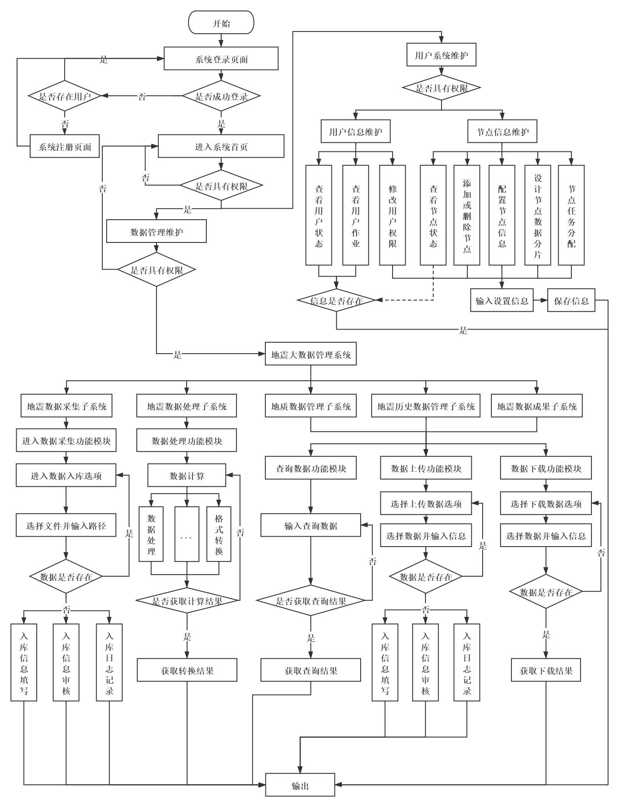

# 基于MongoDB的地震大数据管理系统的设计

[TOC]

## 摘要

## Abstract

## 目录

## 第一章 绪论

### 1.1研究背景

### 1.2 国内外研究进展

### 1.3 目前存在问题

### 1.4 研究的目的和意义

### 1.5 论文的章节安排，研究的内容和方法及技术路线

#### 1.5.1 章节安排

#### 1.5.2 研究的内容和方法及技术路线

## 第二章  需求分析

### 2.1引言

### 2.2地震勘探数据分析

###  SEGY 格式的地震数据 

### 2.3用户需求层次

### 2.4数据导入分析

### 2.5数据模型分析

### 2.6GIS导航分析

### 2.7功能需求分析

## 第三章

### 3.1引言

### 3.2数据库建设思路

### 3.3数据模型概述

## 第四章 系统设计

### 4.1 引言

### 4.2系统设计方案

### 4.3系统构成

### 4.4系统目标

### 4.5系统功能模块设计

### 4.6系统开发模式

### 4.7系统开发平台

## 第五章 结论

## 参考文献

